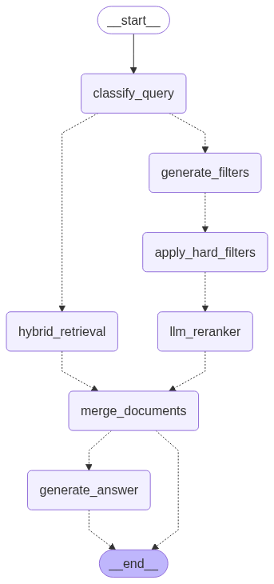

# KAVAK: Conversational Travel Assistant - Hybrid RAG System With LLM Reranking and Hard Filtering

## 🧑🏻‍💻 Developer:

**Huzaifa Khan**  
*AI Engineer*

- 🔗 **LinkedIn**: [linkedin.com/in/huzaifakhan04](https://www.linkedin.com/in/huzaifakhan04/)
- 🐙 **GitHub**: [github.com/huzaifakhan04](https://github.com/huzaifakhan04)
- 📧 **Email**: huzaifa.khan.inbox@gmail.com

*Thank you for taking the time to review this repository. I appreciate your interest and hope this project gives you a clear view of my approach, skills, and thought process.*

---



KAVAK: Conversational Travel Assistant is a sophisticated Hybrid RAG system designed for flight booking and travel information queries. It combines vector search, LLM reranking, and hard metadata filtering to provide accurate and relevant responses to user queries.

## 🚀 Features:

### Core RAG Capabilities:

- **Hybrid Search**: Combines dense vector embeddings with sparse BM25 retrieval.
- **LLM Reranking**: Uses GPT-4o-mini for intelligent document reranking.
- **Hard Metadata Filtering**: Applies precise filters on flight metadata (airline, price, class, etc.).
- **Query Classification**: Automatically classifies queries as flight-specific, info-only, or both.
- **Dynamic Filter Generation**: Uses LLM to generate appropriate filters based on user queries.

### Supported File Types:

- **JSON**: Flight data with structured metadata.
- **Markdown**: Travel policies, visa rules, and documentation.
- **Text**: General travel information and guides.

### Advanced Features:

- **Multi-modal Query Processing**: Handles both flight booking and travel information queries.
- **Intelligent Document Merging**: Combines results from different retrieval paths.
- **Real-time Filter Indexing**: Automatic creation of metadata indexes for efficient filtering.
- **Comprehensive Logging**: Detailed logging for debugging and monitoring.

## 🏗️ Architecture:

The system uses a LangGraph-based workflow with the following components:

1. **Query Classification**: Determines query type (flight/info/both).
2. **Dynamic Filter Generation**: LLM-powered filter creation.
3. **Hard Filtering**: Metadata-based document filtering.
4. **LLM Reranking**: Intelligent document reranking.
5. **Answer Generation**: Context-aware response generation.

## 📋 Prerequisites:

- Python 3.10+
- Qdrant Cloud account
- Gemini Developer API
- OpenAI API (for reranking)

## 🛠️ Installation:

1. **Clone the repository**:

```bash
git clone <repository-url>
cd kavak-conversational-travel-assistant
```

2. **Install dependencies**:

```bash
pip install -r requirements.txt
```

3. **Set up environment variables**:

Create a `.env` file in the project root:
```env
#   Qdrant Cloud Configuration

QDRANT_URL=https://your-cluster.qdrant.io
QDRANT_API_KEY=your-qdrant-api-key

#   Gemini Developer API Configuration

GOOGLE_API_KEY=your-google-ai-api-key

#   OpenAI API Configuration

OPENAI_API_KEY=your-openai-api-key
```

## 🚀 Quick Start:

### 1. Start the API Server:

```bash
python -m uvicorn src.main:app --host 0.0.0.0 --port 8001 --reload --loop asyncio
```

The server will start on `http://localhost:8001`
You can visit the url `http://localhost:8001/docs` to access the interactive API documentation.

### 1.5. (Optional) Launch LangGraph Studio:

```bash
langgraph dev
```

This will start LangGraph Studio on `http://localhost:8123` where you can:

- Visualize the workflow graph.
- Debug and trace execution paths.
- Monitor node performance.
- Test individual nodes.

### 2. Create a Collection:

```bash
curl -X POST "http://localhost:8000/create-collection" \
     -H "Content-Type: application/json" \
     -d '{"collection_name": "flights"}'
```

### 3. Ingest Data:

```bash
#   Ingest flight data:

curl -X POST "http://localhost:8000/ingest" \
     -H "Content-Type: application/json" \
     -d '{
       "filename": "data/flights.json",
       "file_type": "json",
       "collection_name": "flights"
     }'

#   Ingest travel policies:

curl -X POST "http://localhost:8000/ingest" \
     -H "Content-Type: application/json" \
     -d '{
       "filename": "data/refund_policies.md",
       "file_type": "markdown",
       "collection_name": "flights"
     }'
```

### 4. Query the System:

```python
from src.graph import run_search_and_answer

#   Flight-specific query:

result=await run_search_and_answer(
    query="flights from New York to London under $1000",
    collection_name="flights"
)

#   Information query:

result = await run_search_and_answer(
    query="refund policies for cancelled flights",
    collection_name="flights"
)
```

## 🛠️ Development Tools:

### LangGraph Studio:

LangGraph Studio provides a visual interface for debugging and monitoring your LangGraph workflows:

```bash
langgraph dev
```

**Features:**

- **Graph Visualization**: Interactive workflow diagram.
- **Execution Tracing**: Step-by-step execution monitoring.
- **Node Debugging**: Test individual nodes with sample data.
- **Performance Metrics**: Monitor execution times and resource usage.
- **State Inspection**: View intermediate state at each node.

**Access**: It will automatically open in your browser.

## 📊 API Endpoints

### POST `/create-collection`

Creates a new Qdrant collection with vector store initialization.

**Request Body**:

```json
{
  "collection_name": "flights"
}
```

**Response**:

```json
{
  "success": true,
  "message": "Successfully created collection 'flights' with Gemini embeddings (vector size 768)",
  "collection_name": "flights",
  "vector_size": 768,
  "embedding_model": "text-embedding-004"
}
```

### POST `/ingest`

Ingest data from files into the vector store.

**Request Body**:

```json
{
  "filename": "data/flights.json",
  "file_type": "json",
  "collection_name": "flights"
}
```

**Supported (file_type)**: `json`, `markdown`, `text`

## 🔧 Data Generation

The system includes a data generation script for creating synthetic flight data:

```bash
python generate_data.py
```

This will generate:

- `data/flights.json`: Synthetic flight data with comprehensive metadata.
- `data/refund_policies.md`: Refund policy documentation.
- `data/visa_rules.md`: Visa requirement information.

## 🧠 How It Works:

### 1. Query Processing:

- **Classification**: The system first classifies the query type using LLM.
- **Filter Generation**: For flight queries, it generates appropriate metadata filters.
- **Retrieval Strategy**: Chooses between filtered retrieval and simple retrieval.

### 2. Document Retrieval:

- **Hybrid Search**: Combines dense embeddings with sparse BM25.
- **Hard Filtering**: Applies metadata filters (airline, price, class, etc.).
- **Fallback**: If no results with filters, falls back to unfiltered search.

### 3. Document Reranking:

- **LLM Reranking**: Uses GPT-4o-mini to rerank documents by relevance.
- **Context Awareness**: Considers query context for better ranking.

### 4. Answer Generation:

- **Context Assembly**: Combines relevant documents.
- **LLM Generation**: Uses Gemini to generate accurate answers.
- **Source Attribution**: Includes metadata for transparency.

## 📁 Project Structure:

```
kavak-conversational-travel-assistant/
├── src/
│   ├── __init__.py         #   Python package initialization.
│   ├── main.py             #   FastAPI server.
│   ├── graph.py            #   LangGraph workflow.
│   ├── ingestion.py        #   Data ingestion logic.
│   ├── models.py           #   Pydantic models.
│   ├── embeddings.py       #   Embedding model setup.
│   └── client_qdrant.py    #   Qdrant client utilities.
├── data/
│   ├── flights.json        #   Flight data.
│   ├── refund_policies.md  #   Refund policies.
│   ├── visa_rules.md       #   Visa information.
│   └── test.txt            #   Test text file.
├── logs/                   #   Application logs.
├── generate_data.py        #   Data generation script.
├── streamlit.py            #   Streamlit web interface for the application.
├── run.sh                  #   Shell script for running the application.
├── langgraph.json          #   LangGraph configuration file.
├── requirements.txt        #   Python dependencies.
├── graph.png               #   Process flow diagram.
└── README.md               #   This file.
```

## 🔍 Query Examples:

### Flight Queries:

- "flights from New York to London under $1000"
- "Emirates business class flights to Dubai"
- "flights to Japan with layover in Singapore"

### Information Queries:

- "refund policies for cancelled flights"
- "visa requirements for US citizens traveling to India"
- "baggage allowance for international flights"

### Mixed Queries:

- "flights to Turkey and visa requirements"
- "Emirates flights to Dubai and their baggage policy"

## 🛡️ Security Features:

- **Path Validation**: Ensures files are within project directory.
- **Input Validation**: Comprehensive request validation using Pydantic.
- **Error Handling**: Graceful error handling with detailed logging.
- **API Key Management**: Secure environment variable usage.

## 📈 Performance Optimizations:

- **Hybrid Retrieval**: Combines dense and sparse search for better recall.
- **Filter Indexing**: Automatic creation of metadata indexes.
- **Async Processing**: Full async/await support for better concurrency.
- **Caching**: Embedding model and client caching.

## 🐛 Troubleshooting:

### Common Issues:

1. **Qdrant Connection Error**:

   - Verify `QDRANT_URL` and `QDRANT_API_KEY` environment variables
   - Check network connectivity to Qdrant Cloud.

2. **API Key Errors**:

   - Ensure `GOOGLE_API_KEY` and `OPENAI_API_KEY` are set.
   - Verify API keys have sufficient credits.

3. **Collection Creation Fails**:

   - Check Qdrant Cloud permissions.
   - Verify collection name format (alphanumeric, hyphens, underscores).

### Logging:

The system provides comprehensive logging in the `logs/` directory. Check `logs/app.log` for detailed error information.